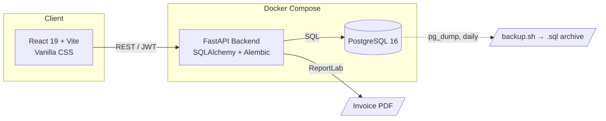
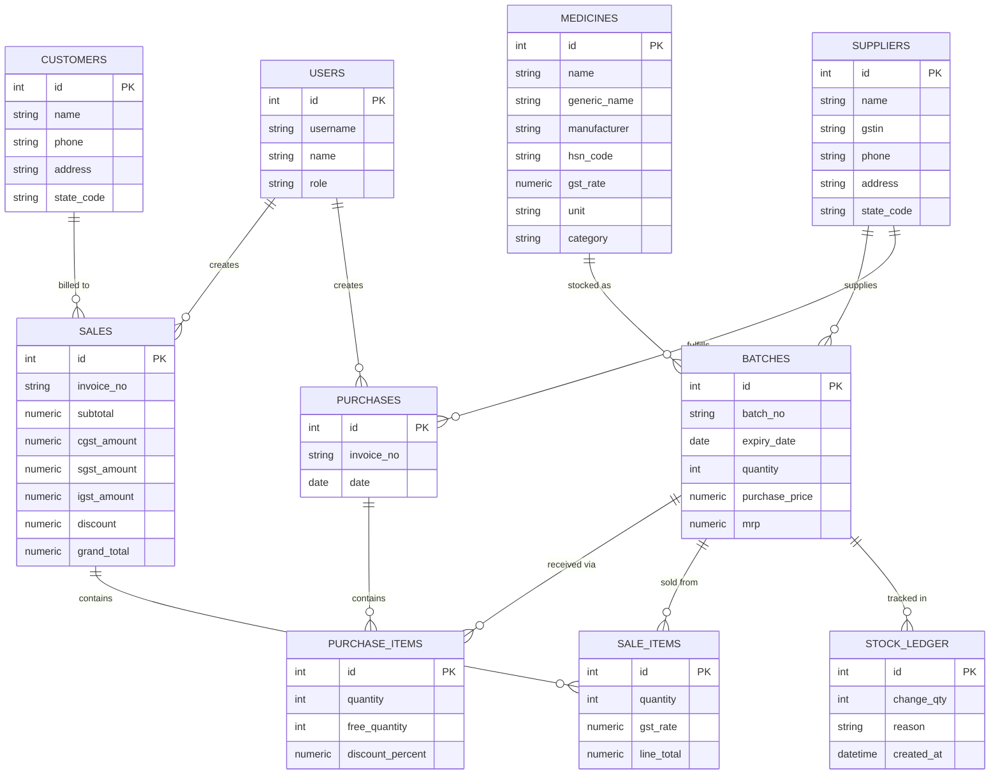

<div align="center">

# 💊 MediLedger

### GST-Compliant Pharmacy Billing & Inventory Suite

*Built for a family-run medical store in Karnataka, India*

[](https://fastapi.tiangolo.com/)
[](https://www.postgresql.org/)
[](https://react.dev/)
[](https://www.docker.com/)
[]()

</div>

---

MediLedger replaces manual pharmacy billing registers with a real, auditable system: GST-correct invoicing, batch-and-expiry-aware stock, and a permanent ledger of every unit that enters or leaves the shop. It's built for one store, running its actual day-to-day billing — not a demo.

## Table of Contents

- [Why This Exists](#why-this-exists)
- [Feature Overview](#feature-overview)
- [What's Changed & Improved](#whats-changed--improved)
- [Architecture](#architecture)
- [Tech Stack](#tech-stack)
- [Database Schema](#database-schema)
- [API Reference](#api-reference)
- [GST Logic](#gst-logic)
- [Project Structure](#project-structure)
- [Getting Started](#getting-started)
- [Environment Variables](#environment-variables)
- [Roadmap](#roadmap)
- [License](#license)

---

## Why This Exists

Most small Indian pharmacies bill on paper or on tools that treat GST, batch expiry, and stock as an afterthought. MediLedger is built the other way round: **every rupee and every unit is traceable.** No stock quantity changes without a reason and a timestamp in `stock_ledger`. No sale goes out without the correct CGST/SGST or IGST split for the customer's state. No batch gets billed past its expiry date, enforced at the API — not just hidden in the UI.

## Feature Overview

**Billing**
- Cart-based point-of-sale billing with live GST calculation
- Automatic CGST + SGST for in-state (Karnataka) customers, IGST for out-of-state
- Server-side rejection of expired or out-of-stock batches — never trusts the frontend alone
- Auto-generated sequential invoice numbers
- On-the-fly, itemized PDF invoice generation (ReportLab)
- **Inline quick-add**: add a new customer or medicine directly from the billing counter without leaving the page — newly created records are auto-selected in the form

**Inventory**
- Full medicine, supplier, customer, and batch management
- Batch-level expiry and MRP tracking, with a dedicated FEFO-sorted "available stock" view
- A dedicated stock-adjustment endpoint (damage, correction, expiry write-off) that **always** logs to the audit ledger — direct quantity edits are blocked at the API level
- Database-enforced uniqueness on `(medicine, batch number, supplier)` so duplicate batches can't be created
- **Per-row delete** on every medicine and every batch with a confirmation prompt
- **Delete All** on both tables with a single button — clears all rows in FK-safe order
- **Inline quick-add medicine and supplier** directly inside the Record Batch form — no page switch needed; newly created items are auto-selected in the dropdown

**Purchasing**
- Supplier purchase entry that creates batches and stock automatically
- Per-line **free quantity** and **discount %** support, matching how Indian pharma distributors actually bill (e.g. "10 + 1 free")

**Audit & Reporting**
- Immutable `stock_ledger` — every sale, purchase, and adjustment is logged with a reason and reference, and is fully queryable via the API
- Expiry alerts (expired / critical ≤7 days / upcoming 8–30 days) and low-stock alerts
- Sales summaries for today, this month, and all-time
- Revenue calculation clamped to a minimum of zero — discounts can never produce a negative grand total

**Access & Operations**
- **Open registration login** — anyone logs in with their Email ID and Full Name; the first login registers the account as admin automatically. No hardcoded default credentials
- **Restore Software** sidebar button — resets all form drafts and UI state to defaults without touching the database
- **Clear History** sidebar button — calls a dedicated backend endpoint that physically deletes all operational records (sales, purchases, batches, medicines, customers, suppliers, stock ledger) in correct FK order while keeping user accounts intact. Dashboard counters return to zero on next refresh
- One-command startup for the full stack (database, API, frontend) via Docker Compose
- Scripted, scheduled PostgreSQL backups with 30-day retention

---

## What's Changed & Improved

This section documents every functional change made on top of the initial implementation.

### 🔐 Login — Open Self-Registration

**Before:** Three hardcoded accounts (`admin / admin123`, `pharmacist / pharma123`, `cashier / cashier123`) had to be used; no way to add new users from the UI.

**After:**
- The login page now accepts **Email ID** (username field) and **Full Name** (name field, visible text — not masked).
- On first submission: the backend registers the user dynamically with the provided email as their identifier and their name as their credential, assigning the **admin** role automatically.
- On subsequent logins: the backend verifies the name matches the stored hash — if not, login is rejected.
- The three default seeded accounts are deleted from the database on every backend startup.
- No passwords, no invite flow, no admin pre-creation needed.

**Files changed:** `backend/app/routers/auth.py`, `frontend/src/pages/LoginPage.jsx`

---

### 🗑️ Clear History — Real Database Wipe

**Before:** "Clear History" only reset React `useState` values in the browser. On page refresh all data returned from the backend unchanged.

**After:**
- "Clear History" calls `POST /analytics/clear-all` before resetting UI state.
- The endpoint deletes all operational rows in correct FK dependency order:
  `stock_ledger → sale_items → sales → purchase_items → purchases → batches → medicines → customers → suppliers`
- User accounts are preserved.
- Dashboard revenue and invoice counters read `0` on next load.
- The sidebar also has a separate **Restore Software** button that resets only UI state (form drafts, cart, active tab) without touching the database.

**Root cause of the original bug:** the user was logged in as a non-admin role, so `POST /analytics/clear-all` returned `403 Forbidden`, the UI cleared locally, and the backend data reappeared on refresh. Fixed by making all self-registered users admins.

**Files changed:** `backend/app/routers/analytics.py`, `frontend/src/App.jsx`

---

### 📦 Inventory — Per-Row Delete & Delete All

**Before:** Neither the Medicines Directory table nor the Recorded Batches table had any delete controls.

**After:**

| Control | Medicines table | Batches table |
|---|---|---|
| Delete individual row | ✅ "Delete" button on every row | ✅ "Delete" button on every row |
| Delete all rows | ✅ "Delete All" button in table header | ✅ "Delete All" button in table header |
| Confirmation prompt | ✅ Modal before every action | ✅ Modal before every action |

- Deleting a medicine that still has active batches linked to sales returns a `400` error with a plain-language message — no silent data corruption.
- A new `DELETE /batches/{batch_id}` endpoint was added to the backend (admin only), with the same FK-safe error handling.
- "Delete All Medicines" first deletes all batches (FK dependency), then all medicines.

**Files changed:** `backend/app/routers/batches.py`, `frontend/src/pages/Inventory.jsx`, `frontend/src/App.jsx`

---

### ⚡ Inline Quick-Add — Billing Counter & Batch Recorder

**Before:** To add a new medicine or customer while billing, the user had to navigate to the Inventory or Customers page, create the record, then navigate back to Billing and re-select it.

**After — Billing Counter:**
- A **"+ Add New Customer"** toggle sits next to the customer dropdown. Clicking it reveals an inline form (Name, Phone, Address, State Code) without leaving the billing view. On save, the new customer is auto-selected.
- A **"+ Add New Medicine"** toggle sits next to the medicine search. The inline form captures all required fields. On save, the medicine appears immediately in the search results.

**After — Record Batch Form (Inventory page):**
- A **"+ Add New"** toggle sits to the right of the "Select Medicine" label. Opens an inline compact form (Name, Generic Name, HSN Code, GST Rate, Unit, Category, Manufacturer). On save, the new medicine is auto-selected in the batch dropdown.
- A **"+ Add New"** toggle sits to the right of the "Select Supplier" label. Opens an inline compact form (Name, GSTIN, Phone, State Code, Address). On save, the new supplier is auto-selected.
- Both toggles show "Cancel Add" when open and collapse without saving if dismissed.

**Files changed:** `frontend/src/pages/Billing.jsx`, `frontend/src/pages/Inventory.jsx`, `frontend/src/App.jsx`

---

### 🐛 Bug Fix — Negative Revenue on Dashboard

**Before:** Applying a large discount could produce a negative `grand_total` (e.g. discount > subtotal + tax), which stored as a negative revenue figure and distorted the dashboard's all-time revenue counter.

**After:** `grand_total = max(Decimal("0.00"), subtotal + cgst + sgst + igst − discount)` — the sale total is floored at zero regardless of discount input.

**Files changed:** `backend/app/routers/sales.py`

---

## Architecture



## Tech Stack

| Layer | Technology |
|---|---|
| Backend framework | FastAPI (Python) |
| ORM & migrations | SQLAlchemy + Alembic |
| Database | PostgreSQL 16 |
| Auth | JWT (OAuth2 password flow), bcrypt hashing, open self-registration |
| PDF generation | ReportLab |
| Frontend | React 19 (Vite), Vanilla CSS |
| HTTP client | Axios |
| Containerization | Docker Compose (db, backend, frontend services) |

## Database Schema



`stock_ledger.reason` is one of `sale`, `purchase`, `adjustment`, or `expiry_removal` — every row is written by the server, never editable by a client.

## API Reference

All endpoints are prefixed as shown and require a `Bearer` JWT except `/auth/login`.

<details>
<summary><strong>Auth</strong> — <code>/auth</code></summary>

| Method | Path | Description |
|---|---|---|
| POST | `/login` | Email ID + Full Name login. Auto-registers if first login, otherwise verifies name matches stored hash. Returns JWT |
| GET | `/me` | Current authenticated user |

**Note:** All self-registered users receive the `admin` role. There are no hardcoded default accounts.

</details>

<details>
<summary><strong>Medicines</strong> — <code>/medicines</code></summary>

| Method | Path | Description |
|---|---|---|
| GET | `/` | List medicines |
| GET | `/{id}` | Get one medicine |
| POST | `/` | Create medicine |
| PUT | `/{id}` | Update medicine |
| DELETE | `/{id}` | Delete medicine (admin only) — fails with `400` if linked batches exist |

</details>

<details>
<summary><strong>Suppliers</strong> / <strong>Customers</strong></summary>

Both expose the same full CRUD set: `GET /`, `GET /{id}`, `POST /`, `PUT /{id}`, `DELETE /{id}`, under `/suppliers` and `/customers` respectively.

</details>

<details>
<summary><strong>Batches</strong> — <code>/batches</code></summary>

| Method | Path | Description |
|---|---|---|
| GET | `/` | List all batches |
| GET | `/available` | In-stock, non-expired batches, sorted by expiry (FEFO reference) |
| GET | `/{id}` | Get one batch |
| POST | `/` | Create batch directly |
| PUT | `/{id}` | Update batch **metadata only** (batch_no, expiry, MRP) — quantity is locked here |
| POST | `/{id}/adjust` | The only way to change quantity outside a sale/purchase — always writes a `stock_ledger` row |
| DELETE | `/{id}` | Delete a batch (admin only) — fails with `400` if batch is referenced by sales or purchases |

</details>

<details>
<summary><strong>Purchases</strong> — <code>/purchases</code></summary>

| Method | Path | Description |
|---|---|---|
| POST | `/` | Record a supplier purchase — creates/updates batches, applies free quantity + discount, writes ledger entries |
| GET | `/` | List purchase history, filterable by supplier and date range |
| GET | `/{id}` | Purchase detail with line items |

</details>

<details>
<summary><strong>Sales</strong> — <code>/sales</code></summary>

| Method | Path | Description |
|---|---|---|
| GET | `/` | List sales |
| GET | `/{id}` | Sale detail |
| POST | `/` | Create a sale — GST split, FEFO-aware stock deduction, invoice numbering, ledger write, all in one transaction. Grand total floored at zero |
| GET | `/{id}/pdf` | Generate and download the GST invoice PDF |

</details>

<details>
<summary><strong>Stock Ledger</strong> — <code>/stock-ledger</code></summary>

| Method | Path | Description |
|---|---|---|
| GET | `/` | Query the full audit trail, filterable by batch, reason, and date range |

</details>

<details>
<summary><strong>Analytics</strong> — <code>/analytics</code></summary>

| Method | Path | Description |
|---|---|---|
| GET | `/alerts` | Expired, critical (≤7d), upcoming (8–30d) expiry buckets, plus low-stock items |
| GET | `/sales-summary` | Revenue and invoice counts — today, this month, all-time |
| POST | `/clear-all` | **Admin only.** Permanently deletes all operational data (stock_ledger → sale_items → sales → purchase_items → purchases → batches → medicines → customers → suppliers) in FK-safe order. User accounts are preserved. Used by the "Clear History" sidebar button |

</details>

Interactive Swagger docs are available at `/docs` once the backend is running.

## GST Logic

The store's registered state is Karnataka (`STORE_STATE_CODE = "29"`), set once in backend config.

- **Customer's state = Karnataka, or no customer specified (walk-in)** → GST splits evenly into **CGST + SGST**
- **Customer's state ≠ Karnataka** → full rate applied as **IGST**

This is computed per line item at sale time and stored as separate `cgst_amount`, `sgst_amount`, and `igst_amount` fields on the sale — never as a single combined tax figure — so reporting can break each out correctly for GST filing.

`grand_total` is stored as `max(0, subtotal + taxes − discount)` — a discount that exceeds the pre-tax total never produces a negative stored value.

## Project Structure

```
MedStock-GST-Pharmacy-Billing-Inventory-Suite/
├── docker-compose.yml
├── backend/
│   ├── Dockerfile
│   ├── requirements.txt
│   ├── alembic.ini
│   ├── scripts/
│   │   └── backup.sh              # Scheduled pg_dump, 30-day retention
│   ├── alembic/versions/          # 3 migrations: initial schema, unique batch
│   │                                 constraint, free_quantity/discount fields
│   └── app/
│       ├── main.py                # App entrypoint, CORS, router registration
│       ├── config.py              # Settings incl. STORE_STATE_CODE
│       ├── db.py                  # SQLAlchemy session setup
│       ├── auth.py                # JWT + bcrypt + RoleChecker
│       ├── models.py              # All 10 ORM tables
│       ├── schemas.py             # Pydantic schemas
│       └── routers/
│           ├── auth.py            # Open self-registration login (Email + Name)
│           ├── medicines.py       # Full CRUD + DELETE with FK guard
│           ├── suppliers.py
│           ├── customers.py
│           ├── batches.py         # + DELETE /{id} endpoint
│           ├── purchases.py
│           ├── sales.py           # grand_total floored at 0
│           ├── stock_ledger.py
│           └── analytics.py       # + POST /clear-all endpoint
└── frontend/
    ├── package.json
    ├── vite.config.js
    └── src/
        ├── main.jsx
        ├── App.jsx                # Shell, sidebar Restore/Clear actions,
        │                            delete handlers, quick-add handlers
        ├── api.js                 # Shared Axios instance + auth headers
        └── pages/
            ├── LoginPage.jsx      # Email ID + Full Name login form
            ├── Dashboard.jsx
            ├── Billing.jsx        # Inline quick-add customer & medicine
            ├── Inventory.jsx      # Per-row delete, Delete All, inline
            │                        quick-add medicine & supplier in batch form
            ├── Customers.jsx
            └── Suppliers.jsx
```

## Getting Started

### Prerequisites
- Docker Desktop (with virtualization enabled in BIOS/UEFI)

### Run the full stack
```bash
git clone https://github.com/vinaybabannavar-create/MedStock-GST-Pharmacy-Billing-Inventory-Suite.git
cd MedStock-GST-Pharmacy-Billing-Inventory-Suite
cp backend/.env.example backend/.env
docker compose up --build
```

| Service | URL |
|---|---|
| Frontend | http://localhost:5173 |
| API | http://localhost:8000 |
| API docs (Swagger) | http://localhost:8000/docs |

### First Login

There are no pre-seeded accounts. On the login page:

1. Enter **any Email ID** (e.g. `yourname@clinic.com`)
2. Enter **your Full Name** (e.g. `Ramesh Kumar`)
3. Click **Enter System / Register**

The backend creates your account as admin on first use. Use the same email + name on every subsequent login.

> **Note:** The three legacy default accounts (`admin`, `pharmacist`, `cashier`) are automatically removed from the database on every backend startup.

### Sidebar Operations

| Button | Action |
|---|---|
| **Restore Software** | Resets all form drafts, cart, and UI state to defaults. Does not touch the database |
| **Clear History** | Calls `POST /analytics/clear-all` — permanently deletes all medicines, batches, sales, purchases, customers, suppliers, and stock ledger entries from the database. User accounts are not deleted. Dashboard resets to zero |

### Backups
```bash
bash backend/scripts/backup.sh
```
Writes a timestamped `.sql` dump and prunes anything older than 30 days. See the script for cron scheduling.

## Environment Variables

Set in `backend/.env` (see `backend/.env.example`):

| Variable | Purpose |
|---|---|
| `DATABASE_URL` | PostgreSQL connection string |
| `SECRET_KEY` | JWT signing secret — change before real deployment |
| `ALLOWED_ORIGINS` | Comma-separated list of allowed frontend origins for CORS |

Set in `frontend/.env`:

| Variable | Purpose |
|---|---|
| `VITE_API_BASE_URL` | Backend API base URL |

## Roadmap

- [ ] GSTR-1-style tax summary report (currently only sales-summary and alerts exist)
- [ ] Server-enforced FEFO on sale (currently advisory via `/batches/available`)
- [ ] Automated test suite covering GST calculation, FK constraint handling, and clear-all ordering
- [ ] Multi-user concurrent billing stress testing on invoice numbering
- [ ] Role selection at registration (currently all self-registered users are admin)
- [ ] Purchase history and stock ledger viewer in the frontend UI

## License

Private project — built for internal use at a family-run medical store in Karnataka, India. Not licensed for redistribution.
