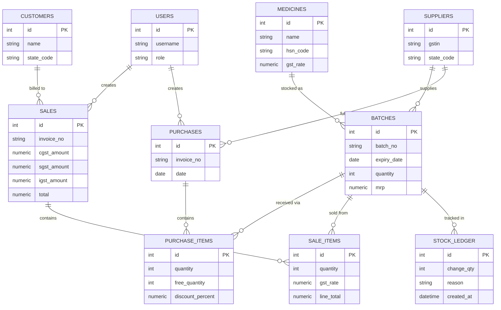

<div align="center">

# 💊 MediLedger

### GST-Compliant Pharmacy Billing & Inventory Suite

*Built for a family-run medical store in Karnataka, India*

[](https://fastapi.tiangolo.com/)
[](https://www.postgresql.org/)
[](https://react.dev/)
[](https://www.docker.com/)
[]()

</div>

---

MediLedger replaces manual pharmacy billing registers with a real, auditable system: GST-correct invoicing, batch-and-expiry-aware stock, and a permanent ledger of every unit that enters or leaves the shop. It's built for one store, running its actual day-to-day billing — not a demo.

## Table of Contents

- [Why This Exists](#why-this-exists)
- [Feature Overview](#feature-overview)
- [Architecture](#architecture)
- [Tech Stack](#tech-stack)
- [Database Schema](#database-schema)
- [API Reference](#api-reference)
- [GST Logic](#gst-logic)
- [Project Structure](#project-structure)
- [Getting Started](#getting-started)
- [Environment Variables](#environment-variables)
- [Roadmap](#roadmap)
- [License](#license)

---

## Why This Exists

Most small Indian pharmacies bill on paper or on tools that treat GST, batch expiry, and stock as an afterthought. MediLedger is built the other way round: **every rupee and every unit is traceable.** No stock quantity changes without a reason and a timestamp in `stock_ledger`. No sale goes out without the correct CGST/SGST or IGST split for the customer's state. No batch gets billed past its expiry date, enforced at the API — not just hidden in the UI.

## Feature Overview

**Billing**
- Cart-based point-of-sale billing with live GST calculation
- Automatic CGST + SGST for in-state (Karnataka) customers, IGST for out-of-state
- Server-side rejection of expired or out-of-stock batches — never trusts the frontend alone
- Auto-generated sequential invoice numbers
- On-the-fly, itemized PDF invoice generation (ReportLab)

**Inventory**
- Full medicine, supplier, customer, and batch management
- Batch-level expiry and MRP tracking, with a dedicated FEFO-sorted "available stock" view
- A dedicated stock-adjustment endpoint (damage, correction, expiry write-off) that **always** logs to the audit ledger — direct quantity edits are blocked at the API level
- Database-enforced uniqueness on `(medicine, batch number, supplier)` so duplicate batches can't be created

**Purchasing**
- Supplier purchase entry that creates batches and stock automatically
- Per-line **free quantity** and **discount %** support, matching how Indian pharma distributors actually bill (e.g. "10 + 1 free")

**Audit & Reporting**
- Immutable `stock_ledger` — every sale, purchase, and adjustment is logged with a reason and reference, and is fully queryable via the API
- Expiry alerts (expired / critical ≤7 days / upcoming 8–30 days) and low-stock alerts
- Sales summaries for today, this month, and all-time

**Access & Operations**
- JWT authentication with three roles — admin, pharmacist, cashier — enforced per endpoint
- One-command startup for the full stack (database, API, frontend) via Docker Compose
- Scripted, scheduled PostgreSQL backups with 30-day retention

## Architecture


## Tech Stack

| Layer | Technology |
|---|---|
| Backend framework | FastAPI (Python) |
| ORM & migrations | SQLAlchemy + Alembic |
| Database | PostgreSQL 16 |
| Auth | JWT (OAuth2 password flow), bcrypt hashing, role-based access |
| PDF generation | ReportLab |
| Frontend | React 19 (Vite), Tailwind CSS |
| HTTP client | Axios |
| Containerization | Docker Compose (db, backend, frontend services) |

## Database Schema



`stock_ledger.reason` is one of `sale`, `purchase`, `adjustment`, or `expiry_removal` — every row is written by the server, never editable by a client.

## API Reference

All endpoints are prefixed as shown and require a `Bearer` JWT except `/auth/login`.

<details>
<summary><strong>Auth</strong> — <code>/auth</code></summary>

| Method | Path | Description |
|---|---|---|
| POST | `/login` | OAuth2 password login, returns JWT |
| GET | `/me` | Current authenticated user |

</details>

<details>
<summary><strong>Medicines</strong> — <code>/medicines</code></summary>

| Method | Path | Description |
|---|---|---|
| GET | `/` | List medicines |
| GET | `/{id}` | Get one medicine |
| POST | `/` | Create medicine |
| PUT | `/{id}` | Update medicine |
| DELETE | `/{id}` | Delete medicine |

</details>

<details>
<summary><strong>Suppliers</strong> / <strong>Customers</strong></summary>

Both expose the same full CRUD set: `GET /`, `GET /{id}`, `POST /`, `PUT /{id}`, `DELETE /{id}`, under `/suppliers` and `/customers` respectively.

</details>

<details>
<summary><strong>Batches</strong> — <code>/batches</code></summary>

| Method | Path | Description |
|---|---|---|
| GET | `/` | List all batches |
| GET | `/available` | In-stock, non-expired batches, sorted by expiry (FEFO reference) |
| GET | `/{id}` | Get one batch |
| POST | `/` | Create batch directly |
| PUT | `/{id}` | Update batch **metadata only** (batch_no, expiry, MRP) — quantity is locked here |
| POST | `/{id}/adjust` | The only way to change quantity outside a sale/purchase — always writes a `stock_ledger` row |

</details>

<details>
<summary><strong>Purchases</strong> — <code>/purchases</code></summary>

| Method | Path | Description |
|---|---|---|
| POST | `/` | Record a supplier purchase — creates/updates batches, applies free quantity + discount, writes ledger entries |
| GET | `/` | List purchase history, filterable by supplier and date range |
| GET | `/{id}` | Purchase detail with line items |

</details>

<details>
<summary><strong>Sales</strong> — <code>/sales</code></summary>

| Method | Path | Description |
|---|---|---|
| GET | `/` | List sales |
| GET | `/{id}` | Sale detail |
| POST | `/` | Create a sale — GST split, FEFO-aware stock deduction, invoice numbering, ledger write, all in one transaction |
| GET | `/{id}/pdf` | Generate and download the GST invoice PDF |

</details>

<details>
<summary><strong>Stock Ledger</strong> — <code>/stock-ledger</code></summary>

| Method | Path | Description |
|---|---|---|
| GET | `/` | Query the full audit trail, filterable by batch, reason, and date range |

</details>

<details>
<summary><strong>Analytics</strong> — <code>/analytics</code></summary>

| Method | Path | Description |
|---|---|---|
| GET | `/alerts` | Expired, critical (≤7d), upcoming (8–30d) expiry buckets, plus low-stock items |
| GET | `/sales-summary` | Revenue and invoice counts — today, this month, all-time |

</details>

Interactive Swagger docs are available at `/docs` once the backend is running.

## GST Logic

The store's registered state is Karnataka (`STORE_STATE_CODE = "29"`), set once in backend config.

- **Customer's state = Karnataka, or no customer specified (walk-in)** → GST splits evenly into **CGST + SGST**
- **Customer's state ≠ Karnataka** → full rate applied as **IGST**

This is computed per line item at sale time and stored as separate `cgst_amount`, `sgst_amount`, and `igst_amount` fields on the sale — never as a single combined tax figure — so reporting can break each out correctly for GST filing.

## Project Structure

```
MedStock-GST-Pharmacy-Billing-Inventory-Suite/
├── docker-compose.yml
├── backend/
│   ├── Dockerfile
│   ├── requirements.txt
│   ├── alembic.ini
│   ├── scripts/
│   │   └── backup.sh              # Scheduled pg_dump, 30-day retention
│   ├── alembic/versions/          # 3 migrations: initial schema, unique batch
│   │                                 constraint, free_quantity/discount fields
│   └── app/
│       ├── main.py                # App entrypoint, CORS, router registration
│       ├── config.py              # Settings incl. STORE_STATE_CODE
│       ├── db.py                  # SQLAlchemy session setup
│       ├── auth.py                # JWT + bcrypt + RoleChecker
│       ├── models.py              # All 10 ORM tables
│       ├── schemas.py             # Pydantic schemas
│       └── routers/
│           ├── auth.py
│           ├── medicines.py
│           ├── suppliers.py
│           ├── customers.py
│           ├── batches.py
│           ├── purchases.py
│           ├── sales.py
│           ├── stock_ledger.py
│           └── analytics.py
└── frontend/
    ├── package.json
    ├── vite.config.js
    └── src/
        ├── main.jsx
        ├── App.jsx                # Shell, routing state, sidebar actions
        ├── api.js                 # Shared Axios instance + auth headers
        └── pages/
            ├── LoginPage.jsx
            ├── Dashboard.jsx
            ├── Billing.jsx
            ├── Inventory.jsx
            ├── Customers.jsx
            └── Suppliers.jsx
```

## Getting Started

### Prerequisites
- Docker Desktop (with virtualization enabled in BIOS/UEFI)

### Run the full stack
```bash
git clone https://github.com/vinaybabannavar-create/MedStock-GST-Pharmacy-Billing-Inventory-Suite.git
cd MedStock-GST-Pharmacy-Billing-Inventory-Suite
cp backend/.env.example backend/.env
docker compose up --build
```

| Service | URL |
|---|---|
| Frontend | http://localhost:5173 |
| API | http://localhost:8000 |
| API docs (Swagger) | http://localhost:8000/docs |

Default seeded accounts (local development only — rotate before real use):

| Username | Password | Role |
|---|---|---|
| admin | admin123 | admin |
| pharmacist | pharma123 | pharmacist |
| cashier | cashier123 | cashier |

### Backups
```bash
bash backend/scripts/backup.sh
```
Writes a timestamped `.sql` dump and prunes anything older than 30 days. See the script for cron scheduling.

## Environment Variables

Set in `backend/.env` (see `backend/.env.example`):

| Variable | Purpose |
|---|---|
| `DATABASE_URL` | PostgreSQL connection string |
| `SECRET_KEY` | JWT signing secret — change before real deployment |
| `ALLOWED_ORIGINS` | Comma-separated list of allowed frontend origins for CORS |

Set in `frontend/.env`:

| Variable | Purpose |
|---|---|
| `VITE_API_BASE_URL` | Backend API base URL |

## Roadmap

- [ ] GSTR-1-style tax summary report (currently only sales-summary and alerts exist)
- [ ] Server-enforced FEFO on sale (currently advisory via `/batches/available`)
- [ ] Automated test suite
- [ ] Multi-user concurrent billing stress testing on invoice numbering

## License

Private project — built for internal use at a family-run medical store in Karnataka, India. Not licensed for redistribution.
